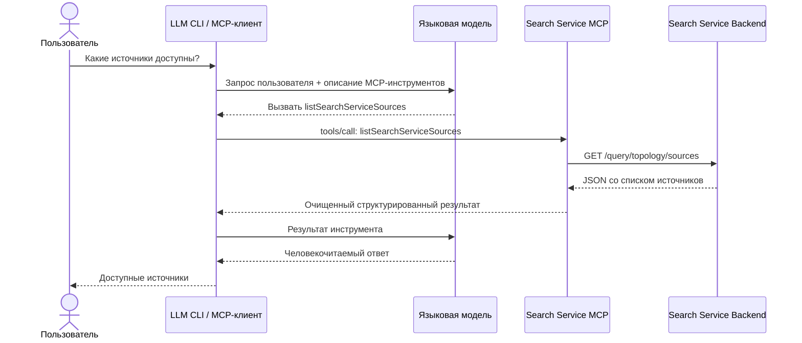
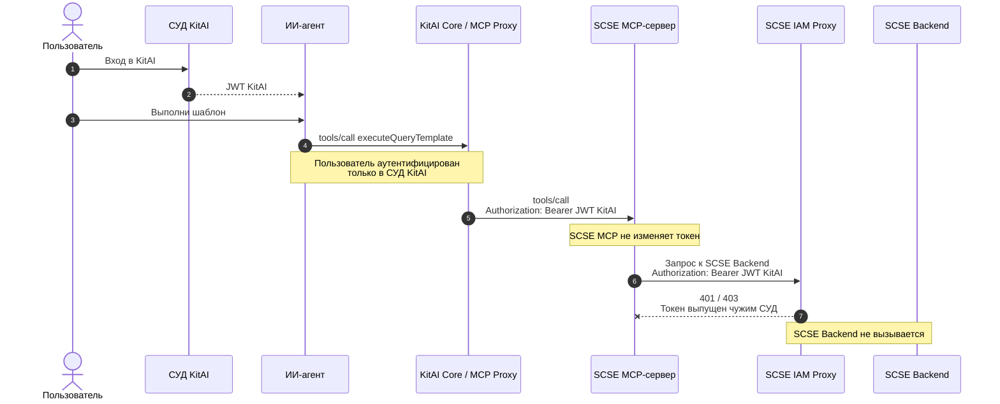

# Как работает Search Service MCP

Search Service MCP — это адаптер между LLM-клиентом и существующим search service backend.

MCP-сервер не содержит собственной языковой модели и не формирует финальный ответ пользователю. Он публикует инструменты в стандартном формате MCP, принимает их вызовы, обращается к backend и возвращает структурированные данные LLM-клиенту.

## Схема вызова



## Обнаружение инструмента

При подключении MCP-клиент запрашивает у сервера список доступных инструментов. Сервер публикует инструмент:

```text
listSearchServiceSources
```

Инструмент не принимает аргументов и возвращает источники, доступные в topology search service.

Языковая модель видит название, описание и входную схему инструмента. Она не знает Java-код MCP-сервера и внутренний адрес backend.

## Выполнение запроса

Когда пользователь спрашивает о доступных источниках:

1. LLM-клиент передаёт модели вопрос и описание MCP-инструмента.
2. Модель решает вызвать `listSearchServiceSources`.
3. MCP-клиент отправляет серверу стандартный запрос `tools/call`.
4. MCP-сервер вызывает backend endpoint `GET /query/topology/sources`.
5. Backend возвращает данные об источниках.
6. MCP-сервер удаляет служебные поля backend, например `status` и `timestamp`.
7. Очищенный структурированный результат возвращается MCP-клиенту.
8. Языковая модель преобразует результат в человекочитаемый ответ.

Пример внутреннего результата инструмента:

```json
{
  "sources": [
    {
      "sourceName": "datastore_clickhouse",
      "description": "Целевое оперативное хранилище",
      "dataBase": "clickhouse"
    }
  ]
}
```

Пример финального ответа пользователю:

```text
Доступен источник datastore_clickhouse — оперативное хранилище на базе ClickHouse.
```

## Ответственность компонентов

| Компонент | Ответственность |
| --- | --- |
| Языковая модель | Понимает вопрос, выбирает инструмент и формулирует финальный ответ |
| LLM CLI / MCP-клиент | Обнаруживает инструменты, отправляет MCP-вызовы и передаёт результаты модели |
| Search Service MCP | Преобразует MCP-вызов в запрос к backend и адаптирует ответ |
| Search Service Backend | Содержит реальные данные и бизнес-логику |
| MCP | Определяет стандарт обмена между клиентом и сервером |

## Проксирование через KitAI Core: проблема разных СУДов

KitAI Core может получить список инструментов SCSE MCP и опубликовать их через
свой MCP-сервер. Проблема возникает при вызове инструмента от имени пользователя:
JWT, выпущенный СУД KitAI, не является JWT, которому доверяет SCSE IAM Proxy.



KitAI Core не может самостоятельно выпустить JWT SCSE: для этого необходим
доверенный SCSE issuer и его закрытый ключ. Для сохранения пользовательской
идентичности требуется согласованный механизм федерации, Token Exchange /
On-Behalf-Of или отдельная аутентификация пользователя в СУД SCSE.

## Текущая конфигурация

MCP-сервер запускается на порту `8081` и по умолчанию обращается к backend по адресу `http://localhost:8080`.

Текущий Streamable HTTP transport:

```text
POST   /mcp
GET    /mcp
DELETE /mcp
```

Внутренний путь вызова:

```text
listSearchServiceSources
  -> HttpSearchServiceTopologyClient
    -> GET /query/topology/sources
      -> Search Service Backend
```
